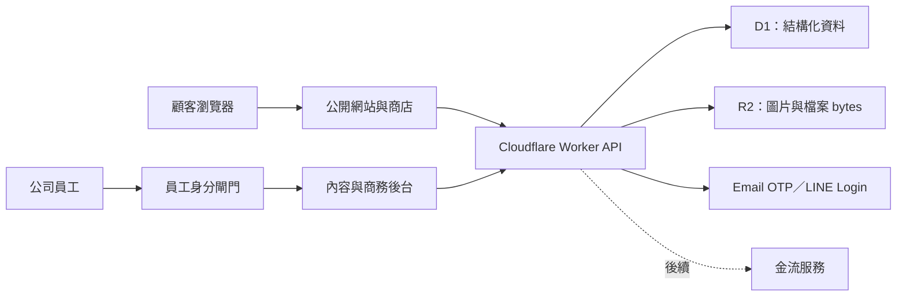

# 泰聚達網站架構與交接總覽

更新日期：2026-08-12
文件用途：記錄目前可驗證的完成狀態、正式上線仍需補齊的能力，以及未來資料庫、部署與營運的共同規格。

## 先讀結論

目前專案是「可在單機完整驗證主要流程的上線候選基礎」，不是已上線的正式商店。

- **已完成並可在本機驗證**：公開網站、RWD、SEO fail-closed 基礎、商品／庫存／訂單、具安全圖片與表格能力的 Tiptap 文章編輯器、Puck 網站編輯器、全站導覽與首頁區塊編排、全站設定版本還原、商品分類 CRUD、商品／文章／頁面伺服器分頁、動態公開分類、庫存調整原因與流水、商品與訂單管理、版本衝突防護、預約庫存與逾期釋放，以及具逐檔 SHA-256 清單的本機 v2 備份、驗證與安全還原。
- **已有程式骨架但仍是本機模式**：D1 相容資料層、Worker API、會員介面、Email OTP／LINE 登入介面、雲端管理員識別介面。
- **必須接上雲端才可完成**：正式 D1、R2 媒體庫、顧客 Session、Email 寄送、LINE OAuth、員工後台 Access、防濫用、排程、監控、備份與還原演練。
- **尚未納入本階段**：金流閘道、電子發票、正式物流串接。它們不可用「本機測試成功」代替正式驗收。

## 狀態標記

| 標記 | 定義 |
|---|---|
| 已落地 | 程式碼存在，且目前測試／本機流程可以驗證 |
| 預留 | 介面或資料模型已設計，但正式服務尚未連接 |
| 需雲端 | 必須有雲端帳號、綁定、網域或第三方憑證才可實作與驗收 |
| 待決策 | 需要公司負責人確認業務、法務、成本或營運規則 |

## 目前架構事實

| 區域 | 現況 | 狀態 |
|---|---|---|
| 公開前台 | Next/vinext 頁面、商品、文章、服務頁、購物車與結帳對話框 | 已落地 |
| 內容後台 | Tiptap 文章編輯、Puck 網站編輯、文章／頁面版本紀錄與 `q`／`status`／`page`／`limit` 伺服器查詢、全站文案與主題 CAS／歷史／還原 | 已落地 |
| 商務後台 | 商品、分類 CRUD、搜尋／篩選／伺服器分頁、SEO、庫存調整原因、訂單、履約與時間軸 | 已落地 |
| 商品分類呈現 | 公開分類由目前商品目錄動態產生；Puck `ProductShowcase` 接受分類名稱或 `all`，不再限於三個固定名稱 | 已落地；Puck 目前仍是文字欄位，需輸入正確名稱 |
| 資料層 | `db/schema.ts`、Drizzle migrations、Worker D1 SQL、本機持久資料 | 已落地 |
| Schema 版本 | Worker 目前以 `schema_metadata.schema_version = 11` 判斷；共 32 張表 | 已落地 |
| 最新 migrations | `0009_concerned_slyde.sql`、`0010_mean_cable.sql` | 已落地；不可改名或改寫已套用 SQL |
| Tenant 完整性 | 44 個 `tenant_guard_*` triggers 驗證跨表 `site_id` 並禁止關鍵 parent 移動站台 | 已落地 |
| 正式資料結構預留 | 會員、同意、挑戰、Session、地址、購物車、加密訂單顧客快照、媒體、付款、物流、webhook、稽核表與 `orders.member_id` | Schema／migration 已落地；API 尚未串接 |
| 公開站台選擇 | `NEXT_PUBLIC_SITE_CODE` 在 build/deploy 時固定；缺省為 `taijuda` | 一個 deployment 服務一個 public site code；沒有中央多站選擇器 |
| SEO 網域閘門 | 未設定有效公開 HTTPS 網址、使用 loopback／內網網址時，自動 noindex、robots 全站封鎖且 sitemap 為空 | 已落地；正式網域仍需部署時設定與 readback |
| D1 綁定 | `.openai/hosting.json` 的邏輯名稱為 `DB` | 預留；尚未確認正式資料庫 |
| R2 綁定 | `.openai/hosting.json` 目前為 `r2: null` | 未落地 |
| 後台登入 | 本機請求視為 `local-preview`；遠端讀取可信邊緣身分 header 並比對 allowlist | 預留；需雲端 |
| 顧客會員 | localhost 有測試 OTP 與裝置資料；非本機預設顯示未設定 | 預留；需雲端 |
| 訂單開關 | localhost 可測試；遠端須明確設定 `STORE_ORDERS_ENABLED=1` | 已有安全閘門；正式仍關閉 |
| 本機資料備援 | `local:backup` 建立 v2 manifest（相對路徑、大小、SHA-256）；可獨立驗證並以 staging rename／rollback 還原 | 已落地；只保護 `.local-data`，不是 D1／R2 正式備援 |
| 公開分享版 | GitHub Actions 部署 GitHub Pages 靜態輸出 | 已落地，但只有展示／SEO，不是商務後端 |
| 正式部署 | Cloudflare Worker／D1／R2、獨立 staging 與 production | 未執行 |
| 金流 | 僅保留訂單付款狀態，不存在付款閘道 | 未落地 |

## 系統邊界

核心原則：

1. D1 保存可查詢、可交易的結構化狀態；R2 只保存圖片與檔案 bytes。
2. `media_assets` 在 D1 保存 R2 object key、MIME、雜湊、尺寸、狀態與權限；商品／文章只參照媒體 ID。
3. 顧客會員與員工後台是兩套身分系統，不共用登入、Session 或權限規則。
4. GitHub Pages 只能做靜態展示；不得把它描述成已有正式會員、資料庫、接單或後台保護。
5. 正式資料庫 migration 應在部署階段執行並驗證；Worker 啟動時自動補表只保留給本機開發，不作正式部署策略。
6. D1 schema 雖以 `site_id` 隔離並可承載多站資料，目前產品邊界仍是「一個 deployment、一個 `NEXT_PUBLIC_SITE_CODE`」；尚未提供中央多站切換、跨站帳號或站台建立介面。
7. 本機 v1 legacy backup 沒有逐檔雜湊，只能辨識與做基本安全檢查，禁止直接 restore；可還原來源必須是驗證通過的 v2 精確資料夾。

## 文件索引

- [production-data-model.md](production-data-model.md)：D1／R2 邊界、資料表、關係、PII 與保留政策。
- [erd.md](erd.md)：現況與目標資料模型的 Mermaid ERD。
- [environment-matrix.md](environment-matrix.md)：local、staging、production 的差異與綁定。
- [deployment-blueprint.md](deployment-blueprint.md)：GitHub 到 Cloudflare、migration gate、發版與回復策略。
- [security-and-privacy.md](security-and-privacy.md)：員工／顧客登入、安全控制與個資處理。
- [backup-restore-runbook.md](backup-restore-runbook.md)：備份、還原、RPO／RTO 與演練。
- [operations-checklist.md](operations-checklist.md)：上線前、每日營運、事故與變更檢查表。
- [owner-input-checklist.md](owner-input-checklist.md)：站主必填且不得虛構的公司、聯絡、配送、個資與 provider 資料。
- [dependency-risk-register.md](dependency-risk-register.md)：production 與開發工具依賴風險、已知上游缺口及升級 gate。

## 交接時的來源優先順序

文件與程式不一致時，依下列順序查證，並回寫文件：

1. `db/schema.ts` 與已提交的 `drizzle/*.sql`。
2. `worker/database.ts`、Worker API 與測試。
3. `.openai/hosting.json`、部署 workflow 與實際雲端綁定。
4. 本資料夾的架構說明。

不得只看畫面或 GitHub Pages 網址判定功能已上線。正式驗收至少要有 staging 實測、資料庫 readback、身分與權限測試、備份還原演練及 production smoke test。
