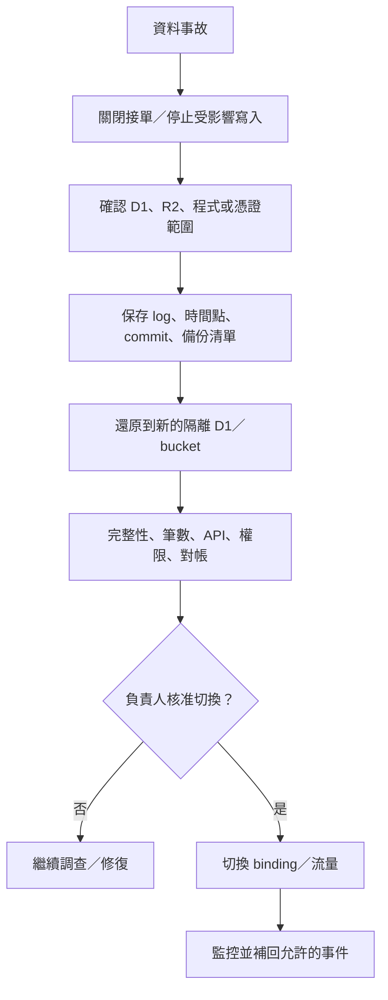

# 備份與還原 Runbook

## 1. 目標與範圍

這份 runbook 涵蓋 D1 結構化資料、R2 媒體、部署設定與內容快照。Git repository 不是資料庫備份；R2 也不是 D1 備份。

### 建議服務目標

| 等級 | 範圍 | RPO | RTO | 說明 |
|---|---|---:|---:|---|
| 核心商務 | 訂單、庫存、會員、付款事件 | 15 分鐘提案 | 4 小時提案 | 需平台能力、增量／事件備援與演練支援 |
| 內容 | 商品、文章、頁面、設定 | 24 小時 | 8 小時 | Git／發布快照可協助重建，但 D1 仍是工作資料 |
| 媒體 | R2 原圖與衍生圖 | 24 小時 | 24 小時 | 原圖優先；衍生圖可重建 |

以上是業務目標，不是目前已達成的 SLA。正式上線前需依 Cloudflare 方案、備份目的地與人力確認能否做到。

## 2. 本機 v2 備份、驗證與還原

本節是目前已落地、可操作的 `.local-data` 保護流程。它只適用於本機版，不包含正式 D1、R2、第三方 provider 或 secrets，也不能用來宣稱已具備 production disaster recovery。

### 2.1 建立與驗證備份

建立備份：

```powershell
npm run local:backup
```

工具會把非空的 `.local-data` 複製到 `.local-backups\taijuda-data-<timestamp>`。若網站由本機啟動器管理，工具會先停止、確認 port 已釋放，備份完成後再啟動；若 port 由未知程序占用，則拒絕備份，不會熱拷貝正在寫入的資料。

每份新備份的 `backup-manifest.json` 使用 `taijuda-local-data-backup-v2`，至少記錄：

- `createdAt`、`source = ".local-data"`、`siteCode = "taijuda"`、`purpose`（`manual` 或 `pre-restore`）。
- 每個 regular file 的安全相對路徑、整數 byte size 與小寫 SHA-256。
- 排序後且不可重複的完整檔案清單；不接受 path traversal、符號連結、junction 或特殊檔案。

對已存在的單一備份做唯讀驗證時，必須提供一個**確切資料夾**，不可用萬用字元、`~`、`..`、專案根目錄、使用者家目錄或資料根目錄：

```powershell
npm run local:backup:verify -- "C:\exact\taijuda-data-YYYYMMDD-HHMMSS"
```

v2 驗證會要求實際檔案集合與 manifest 完全相同，並逐檔比對 size 與 SHA-256；多檔、少檔或內容不一致都不通過。舊 `taijuda-local-data-backup-v1` 可被辨識並完成基本格式／檔案安全檢查，但因沒有逐檔雜湊，`restorable = false`，**不得直接還原**。必須先用相容舊版啟動該資料，再用目前版本重新建立 v2。

### 2.2 執行本機還原

1. 記下要還原的精確 v2 路徑，先執行上一節的 `local:backup:verify`。
2. 停止本機站台：

   ```powershell
   npm run local:stop
   ```

3. 確認網站已停止且 port 3000 沒有任何程序占用。還原指令會再次檢查；任一條件不符即 fail closed。
4. 執行：

   ```powershell
   npm run local:restore -- "C:\exact\taijuda-data-YYYYMMDD-HHMMSS"
   ```

還原工具只會寫入本專案固定的 `.local-data`，其提交流程如下：

1. 再次驗證來源 v2，先將 payload 複製至同磁碟 staging 資料夾並重驗 manifest。
2. 若目前已有 `.local-data`，在交換前先建立 `purpose = "pre-restore"` 的可還原 v2 備份。
3. 提交前再次確認站台與 port 均停止；以 rename 把目前資料移到 `restore-previous`，再把 staging rename 成 `.local-data`。
4. 安裝後再次比對檔案集合、大小與 SHA-256。若中途失敗，自動把原資料 rename 回去並清除 staging；若 rollback 也失敗，保留 previous、staging 與預還原備份，且不得啟動網站，需先人工處理。
5. 成功後保留 pre-restore v2 備份；previous 暫存會移除，移除失敗時工具會明確警告。

不要手動刪除 `.local-data` 或自行覆蓋檔案來替代此流程。

### 2.3 還原後驗收

檔案 restore 成功不等於應用健康。工具刻意**不自動啟動，也不宣告 migration／health 通過**。接著執行：

```powershell
npm run local:start
npm run local:status
```

並完成以下 readback：

- `http://127.0.0.1:3000/api/admin/system-status?site=taijuda` 可正常回應。
- migration 已完成，`schema_metadata = 11`、32 張表與 44 個 `tenant_guard_*` triggers 均存在。
- 首頁、文章／頁面後台、商品／分類、庫存、訂單與全站設定可讀；抽樣一筆還原前資料核對內容與版本。
- 建立一筆不含真實個資的測試修改，再重新備份並通過 `local:backup:verify`。

若 `local:start`、migration 或 health 失敗，立刻 `local:stop`，保存 log 與 pre-restore 備份，不要反覆寫入。需要回到還原前狀態時，以顯示出的 `taijuda-pre-restore-*` 精確路徑重走本節流程。

## 3. 備份組合

| 資產 | 方法 | 頻率 | 保存提案 | 狀態 |
|---|---|---:|---:|---|
| 本機資料 | `npm run local:backup` + `local:backup:verify`；必要時 `local:restore` | 重大修改前與每日工作結束 | 至少 7 份，另複製到異機位置 | v2 已落地；v1 禁止 restore |
| D1 全量 export | 排程 SQL export，壓縮、加密、checksum | 每日 | 35 日 + 每月 12 份 | 需雲端 |
| D1 Time Travel | 啟用並記錄可回復窗口 | 平台持續 | 依方案 | 需雲端；不能代替離線 export |
| 交易增量／事件 | 訂單、付款、庫存事件的可重播紀錄 | 接近即時 | 與交易保存期一致 | provisional |
| R2 原圖 | 版本／複寫或週期 inventory + 備份 bucket | 每日／依平台 | 90 日刪除保護提案 | 需雲端 |
| R2 manifest | 匯出 `media_assets` + object inventory + checksum | 每日 | 與 D1 export 同批 | 需雲端 |
| 發布快照 | `content/published-site.json` + snapshot hash | 每次發布 | Git 歷史／release artifact | 已落地 |
| 設定 | 綁定名稱、非秘密變數、workflow、DNS 清單 | 每次變更 | Git + 變更紀錄 | 部分落地 |
| Secrets | Secret manager 自身備援／輪替紀錄 | 每次變更 | 不匯出到 Git | 需雲端 |

備份檔命名建議：`taijuda-{env}-d1-{UTC timestamp}-{schema version}-{commit}.sql.gz.enc`。manifest 另含 SHA-256、表筆數、export 工具版本與操作者。

## 4. 每日備份驗證

1. 本機 v2 以精確路徑執行 `npm run local:backup:verify -- "<exact-dir>"`；雲端則確認新備份存在、大小合理且 timestamp 在 SLA 內。
2. 驗證 SHA-256 與加密檔可解密；不要只看 job 顯示 success。
3. 比較主要表筆數與前一日增量：`site_settings_revisions`、`orders`、`order_customer_snapshots`、`order_items`、`inventory`、`inventory_movements`、`members`、`member_consents`、`media_assets`。
4. 確認 migration journal／`schema_metadata` 隨 export 保存。
5. 對照 R2 manifest：missing object、orphan object、hash mismatch 分開報告。
6. 失敗時立即重跑一次；第二次失敗升級事故，不等待隔日。

## 5. 雲端還原決策



原則：永遠先還原到新資源，不直接覆蓋唯一 production D1／R2。Time Travel 也先建立可驗證副本；只有驗證與核准後才切 binding。

## 6. D1 還原程序

1. 指定事故時間、最後已知良好時間、目前 schema version 與 commit。
2. 關閉 `STORE_ORDERS_ENABLED`，必要時把會員／後台寫入設為唯讀。
3. 匯出目前受損資料作證據，不覆蓋事故前備份。
4. 選擇 Time Travel 時點或已驗 checksum 的 D1 export。
5. 建立全新的 recovery D1，先套用正確 schema／migration，再匯入資料；依備份格式決定順序。
6. 執行 `PRAGMA foreign_key_check`、關鍵 unique／check、表筆數、總額、庫存對帳與抽樣 readback。
7. 對每張未完成訂單驗證 order items、reserved 與 movement；付款已成功但訂單缺失時禁止自動重扣。
8. 用 staging Worker 暫時綁 recovery D1，跑公開、會員、後台與商務 smoke test。
9. 由兩人核准切換 production binding；記錄舊／新 database ID。
10. 觀察至少一個完整營運週期後才封存舊 DB；不可立即刪除。

## 7. R2 還原程序

1. 從同一備份批次讀取 `media_assets` export、R2 inventory 與 checksum manifest。
2. 建立 recovery bucket 或 prefix；恢復原圖，再恢復／重建衍生圖。
3. 逐筆驗 object key、byte size、MIME、SHA-256；檔名相同不代表內容相同。
4. 抽樣驗證公開與私有 object 權限、cache header、圖片尺寸與 alt metadata。
5. 切換 R2 binding／delivery route；D1 media ID 與 object key 不應因切換而改變。
6. missing object 保持明確 placeholder 並建立修復清單，不要以錯誤商品圖代替。

## 8. 還原驗收查詢與業務不變量

- 所有 FK 通過；沒有孤兒 order item、revision、media join。
- `schema_metadata = 11`、共 32 張表，且 44 個 `tenant_guard_*` triggers 全數存在；跨站關聯測試仍被拒絕。
- 每站 `site_settings` 的目前 version 都能在 `site_settings_revisions` 找到對應快照；還原操作只建立更高的新版本，不讓 version 倒退。
- 每個 product 的 `0 <= reserved <= on_hand`。
- 未完成且在保留期內的訂單，其 reservation movement 與 reserved 相符。
- cancelled／expired 訂單不再占用 reserved。
- order subtotal 等於 items line total 加總；shipping fee 另列。
- 正式訂單每筆最多一筆 `order_customer_snapshots`；encrypted payload 可用對應 key version 解密，phone／Email hash 與明文正規化值 readback 相符。
- payment／refund 金額不超過訂單允許範圍（付款模組上線後）。
- 登出／撤銷 Session 在還原後仍不可重新有效；必要時全域旋轉 Session secret。
- 公開 sitemap 不含 draft、archived、noindex 或未核准商品。

## 9. 演練

- 每月：抽一份本機 v2 備份還原，驗證停止／pre-restore／rename／rollback 保護與啟動後 migration／health；只用測試資料。
- 每季：完整 D1 + R2 還原到隔離環境，量測 RPO／RTO。
- 每月：抽樣解密 D1 export，跑 schema／FK／筆數檢查。
- 每次 schema 大改前：以 production-like snapshot 套 migration + rollback 決策演練。
- 每次 LINE／Email／Session secret 變更：演練撤銷 Session 與 provider 故障降級。

演練報告要記錄：日期、情境、備份時間、實際 RPO、開始／可用時間、實際 RTO、資料差異、操作者、核准者與改善期限。

## 10. 禁止事項

- 不把 GitHub、單一 D1 export、Time Travel 或同 bucket 複本視為完整備份。
- 不把解密金鑰與備份檔放在同一位置。
- 不在未驗證時直接覆蓋 production。
- 不使用真實顧客資料做開發測試；還原演練若需 production snapshot，先去識別並限制存取。
- 不在事故期間刪除 log、舊 database、舊 bucket、migration 或付款 webhook。
- 不把 v1 legacy backup、未通過逐檔驗證的資料夾或手動拼湊的檔案當成可還原來源。
- 不在本機網站或 port 仍運行時 restore，也不把「檔案交換完成」當成 migration 與 health 已通過。
