# 部署藍圖

## 1. 目前與目標

目前 `.github/workflows/deploy-pages.yml` 會在 `main` 建置、測試並部署 GitHub Pages。該輸出刻意排除後台、會員、Worker API、OTP 與結帳個資流程，因此它是可分享的靜態展示站，不是正式商店。

正式目標是：GitHub 保管程式碼與審查紀錄；Cloudflare 執行 vinext Worker、D1、R2、網域與邊緣身分控制。GitHub Pages 可保留為 demo，但不得使用正式網域，也不得與正式商務狀態混淆。

每個 Cloudflare deployment 必須明確設定一個 `NEXT_PUBLIC_SITE_CODE`，並只對應一個公開品牌。D1 可保存多個 `site_id`，但目前沒有中央多站選擇器或跨站營運後台；多品牌應各自部署。`NEXT_PUBLIC_*` 不是安全邊界，因此 production Worker 仍須拒絕與該 deployment 不符的 site request，或讓各 deployment 使用只含自身站台的 D1。

```mermaid
flowchart LR
  Dev["功能分支"] --> PR["Pull Request"]
  PR --> CI["型別／Lint／測試／Build／Audit"]
  CI --> Merge["核准合併"]
  Merge --> Staging["部署 Staging"]
  Staging --> MigrateS["Staging migration + smoke test"]
  MigrateS --> Approval["人工核准"]
  Approval --> Backup["Production 備份與 migration gate"]
  Backup --> Prod["部署 Production Worker"]
  Prod --> Smoke["readback／smoke／監控"]
  Smoke --> Enable["最後開啟接單旗標"]
```



## 2. GitHub workflow 拆分建議

| Workflow | 觸發 | 職責 | 可否寫 production |
|---|---|---|---|
| `ci.yml` | 每個 PR／push | `npm ci`、typecheck、worker typecheck、lint、build、core tests、靜態 export 驗證、production audit | 否 |
| `deploy-staging.yml` | 合併至 staging 分支或手動 | staging migration、部署、smoke、測試報告 | 只可寫 staging |
| `deploy-production.yml` | 已核准 tag／手動 | production backup、migration gate、部署、smoke、release record | 是；需 GitHub Environment approval |
| `deploy-pages.yml` | `main` | 可選 demo／靜態展示 | 否 |

每個部署必須可追溯：Git commit、migration 清單、snapshot hash、部署者、開始／結束時間與 smoke 結果。

## 3. Branch 與審查

- 功能開發：`codex/*` 或團隊約定的 feature branch。
- `main`：隨時可部署，但不代表自動開啟接單。
- Production：只接受受保護環境的人工核准；不得由未審查的本機目錄直接發布。
- Schema、auth、付款、個資匯出或備份變更至少一名非作者審查。
- Secrets 只放 GitHub Environment／Cloudflare Secret Store；PR log 與 build artifact 禁止包含 secret。

## 4. Migration gate

正式版不得依賴 `ensureDatabase()` 在第一個顧客請求中自動建表或升級。它目前適合本機相容性啟動；production 應改成部署前 migration，Worker 啟動只檢查版本並在不相容時 fail closed。

目前 migration 鏈必須依序包含：

- `0009_concerned_slyde.sql`：會員／正式商務預留結構、child `site_id` 與 44 個 tenant guards，schema version 10。
- `0010_mean_cable.sql`：新增 `site_settings_revisions`、回填現有 `site_settings` 快照，schema version 11。

不得只套 `0010`、改寫或重新命名已套用的 `0009`。Migration readback 要同時檢查既有訂單保留、設定歷史回填與 tenant 負向案例。

### Gate 順序

1. 確認目前 production schema version、migration journal 與目標 commit。
2. 產生 D1 export，記錄檔案雜湊、筆數、時間與保存位置。
3. 在 staging 的 production-like snapshot 套用相同 migrations。
4. 執行 migration smoke test、主要 API 測試、FK／unique／index／tenant trigger 檢查。
5. 確認 migration 為 backward-compatible；若不是，先部署可同時讀舊／新 schema 的版本。
6. 由核准者解除 production environment gate。
7. 套用 production migration；readback `schema_metadata = 11`、32 張表、44 個 `tenant_guard_*` triggers 與關鍵表筆數。
8. 部署 Worker；跑 smoke test。
9. 觀察錯誤率與延遲，最後才開啟功能旗標。

Wrangler 指令格式需在 Cloudflare project／environment ID 確定後寫入 workflow。可使用下列形式作為文件範本，執行前必須替換並 readback：

```powershell
npx wrangler d1 migrations list <D1_DATABASE> --remote --env staging
npx wrangler d1 migrations apply <D1_DATABASE> --remote --env staging
```

不可把 `<D1_DATABASE>` 留在真正 workflow，也不可對 production 使用 `--local` 結果作為套用證明。

## 5. 發布內容與 SEO

目前 SEO 靜態路由由 `content/published-site.json` 的受控快照建立。正式版二選一，需在上線前決定：

1. **受控快照發布（建議起步）**：後台發布 → 匯出 D1 已發布內容 → 驗證 snapshot → 觸發 build/deploy。優點是 SEO 輸出穩定、可審核；缺點是內容不是立即上線。
2. **Worker 動態內容**：公開頁直接讀 D1 並快取。優點是即時；缺點是快取失效、SEO metadata、D1 query budget 與錯誤回復更複雜。

無論選哪個方案，公開商品條件都必須同時符合業務狀態與 SEO readiness；草稿、封存或資料未確認的商品不得進 sitemap。

## 6. Production 發版檢查

發版前在乾淨環境執行：

```powershell
npm ci
npm run typecheck
npm run typecheck:worker
npm run lint
npm run build
npm run test:core
npm run test:pages
npm run audit:prod
```

Cloudflare 部署後至少驗證：

- 首頁、文章列表／內頁、商品列表／內頁、robots、sitemap 回應與 canonical origin。
- 未登入者無法讀取／寫入 `/api/admin/*`。
- 非 allowlist 員工被拒絕；allowlist 員工可操作且 `actor` 正確。
- D1 schema v11、32 張表、44 個 tenant guards，以及跨站 parent／child 與關鍵 parent `site_id` 移動都被拒絕。
- `NEXT_PUBLIC_SITE_CODE`、canonical origin、公開內容、購物車 key 與後台 API 都指向同一站台；不存在公開 tenant drift。
- 直接以另一個 site query 呼叫公開／後台 API 會被 server 拒絕，或目標 D1 根本不存在其他站台資料；不能只驗前端固定 code。
- 全站設定 save CAS、歷史分頁與還原會建立新版本；不會覆蓋並行更新。
- 商品分類新增／修改／封存／安全刪除、商品搜尋／狀態／分類篩選與伺服器分頁。
- 文章與頁面清單的 server-side `q`／`status`／`page`／`limit`、預設 40／上限 100、非法 status 與超出頁碼回應。
- 建立非固定三類的新分類並指派可見商品後，公開分類／篩選器與 Puck `ProductShowcase` 可使用該分類；Puck 文字值需與分類名稱一致。
- 商品／庫存／訂單查詢及 optimistic version 衝突；實有庫存變更需至少 4 字原因且寫入 adjustment movement。
- 會員匿名、登入、登出、Session 到期與撤銷。
- 建單冪等、庫存保留、取消／逾期釋放；測試訂單須立即取消並註記。
- R2 圖片 MIME、cache、權限、alt 與失敗 fallback。
- 告警、備份與接單 kill switch 可用。

## 7. Rollback

1. **先止血**：將接單／新功能旗標關閉，不刪資料。
2. **程式 rollback**：部署上一個已知良好 commit；前提是 schema migration 向後相容。
3. **資料 forward-fix**：優先新增修復 migration，避免直接 down migration 造成資料遺失。
4. **隔離寫入**：若資料一致性未知，將受影響 API 設為唯讀，保留公開內容。
5. **資料庫還原**：只有確認資料損毀、已保存事故證據且經負責人核准才做；先還原到新 D1，驗證後再切換 binding。
6. **R2 還原**：依 D1 `media_assets` manifest 與物件版本／備份恢復，切勿用檔名猜測引用。

不要在事故時直接刪 migration、改寫已套用 SQL、清空 D1 或覆蓋 production bucket。

## 8. 待確認的部署決策

- 正式網域、staging 子網域與 Cloudflare account／project 名稱。
- 是否保留 GitHub Pages demo；若保留，首頁必須清楚標示非正式商店。
- Cloudflare Access 的員工群組與緊急 break-glass 帳號持有人。
- D1／R2 的區域、費用預算、備份保存目的地與 on-call 名單。
- 內容採受控快照發布或動態 D1。
- 每個品牌的 deployment 名稱、`NEXT_PUBLIC_SITE_CODE` 與 domain 對照表；中央多站管理仍不在目前完成範圍。
