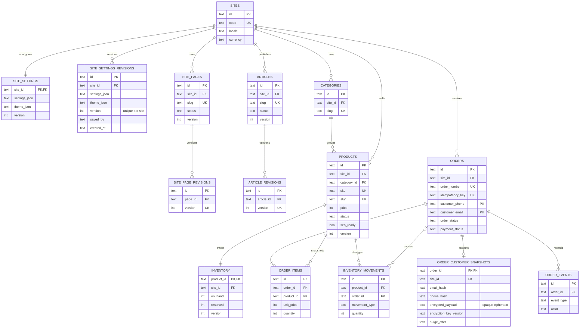
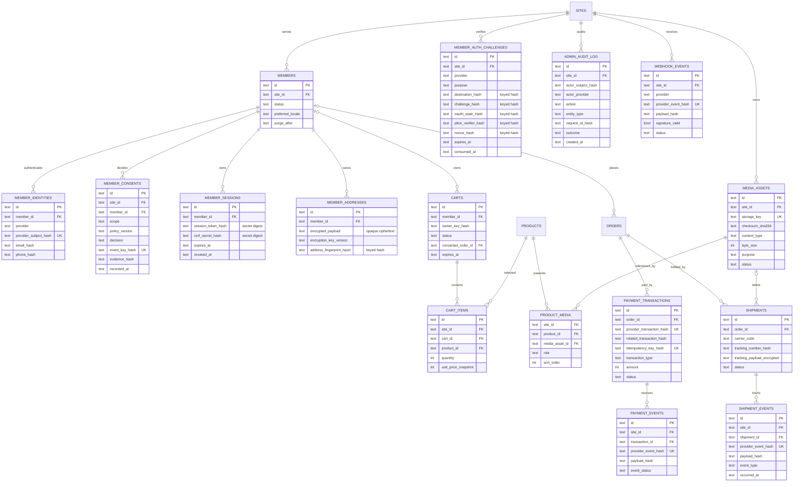

# 資料關係圖

## 已落地核心資料流：Schema v11

## Schema v11 已預建：正式會員、媒體、付款與物流

此圖的 future-ready 資料表由 `drizzle/0009_concerned_slyde.sql` 建立；`drizzle/0010_mean_cable.sql` 再新增第 32 張表 `site_settings_revisions`，目前 schema 版本為 11。對應會員 API、加密金鑰、R2、登入 provider、金流與物流仍未串接。

關係圖只畫 FK 主路徑；資料庫另有 44 個 `tenant_guard_*` triggers，強制 parent／child 同站並禁止關鍵 parent 的 `site_id` 直接移動。目前前台是一個 deployment 固定一個 `NEXT_PUBLIC_SITE_CODE`，不是中央多站選擇器。

